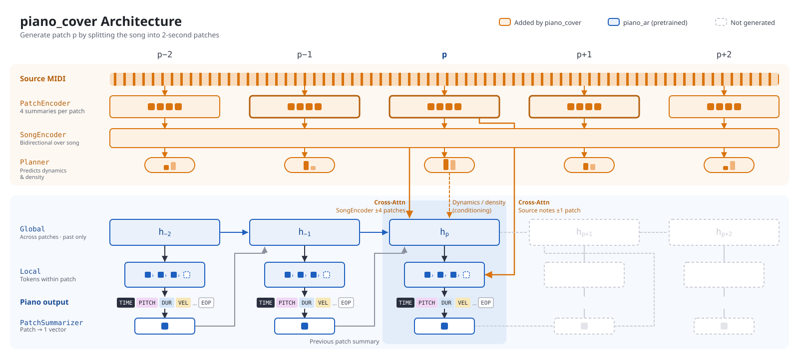
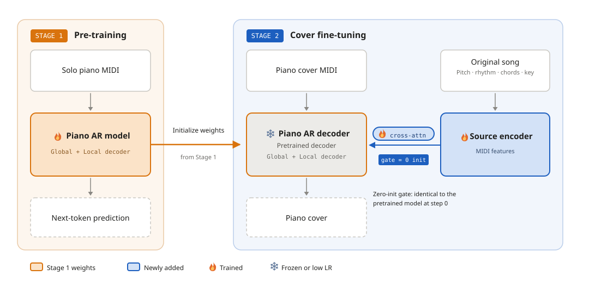

# tsumugi-piano-cover

**Generate piano covers of pop songs as MIDI.** The system first transcribes an audio track into multi-instrument MIDI using [tsumugi](https://github.com/anime-song/tsumugi), then generates an arrangement using an autoregressive piano model pretrained on ~3,000 hours of piano performances.

[日本語 README](README_ja.md) | [](LICENSE) | [](https://huggingface.co/anime-song/tsumugi-piano-cover) | [](https://colab.research.google.com/github/anime-song/tsumugi-piano-cover/blob/main/notebooks/cover_studio_colab_en.ipynb)

- 🎹 **Aligned to Original Timeline**: Play back covers synchronously with the original audio track.
- 🎚️ **Controllable Arrangements**: Fine-tune fidelity to the source, dynamics, fills, pitch range, and performer styles.
- 🔁 **Cover Studio**: Interactive web UI for iterative generation, comparing takes, and inpainting/regenerating from any point.

---

## Quick Start

### Google Colab

The fastest way to get started is the Colab notebook ([English](https://colab.research.google.com/github/anime-song/tsumugi-piano-cover/blob/main/notebooks/cover_studio_colab_en.ipynb) / [日本語](https://colab.research.google.com/github/anime-song/tsumugi-piano-cover/blob/main/notebooks/cover_studio_colab_ja.ipynb)). Select a GPU runtime, run the first cell, and open **Cover Studio** to transcribe, generate, compare, and download covers directly from your browser.

### Local Installation

Requires Python 3.12 and an NVIDIA GPU (CPU is supported but significantly slower).

```bash
git clone https://github.com/anime-song/tsumugi-piano-cover.git
cd tsumugi-piano-cover
python -m venv .venv
.venv/bin/pip install -r requirements.txt     # Windows: .venv\Scripts\pip
.venv/bin/python -m cover_studio              # Opens http://127.0.0.1:8100
```

Model weights are downloaded automatically from Hugging Face on the first run. The prebuilt frontend UI is fetched from GitHub Releases (Node.js is not required).

To enable audio transcription within Cover Studio, set up tsumugi in `.tsumugi/tsumugi`:

```bash
git clone https://github.com/anime-song/tsumugi.git .tsumugi/tsumugi
cd .tsumugi/tsumugi
uv sync --locked --extra stem
```

Cover Studio automatically detects tsumugi and runs it using tsumugi's Python environment (custom path configurable via `--tsumugi-dir`). On Windows, torchcodec requires shared FFmpeg libraries; place them in `.tsumugi/ffmpeg-shared/bin` or specify `--ffmpeg-dir`. If you already have a transcribed MIDI file, you can upload it directly with the audio without installing tsumugi.

---

## Cover Studio


Audio is transcribed once per song. Once loaded, the model stays in memory for fast iterations:

- **Take History**: Preserves settings, random seeds, and checkpoint metadata for each take. "Reuse settings" restores parameters to the Create panel. Filter chips highlight settings modified from default values.
- **Regenerate from Playhead**: Keep the generated performance up to the cursor and regenerate the remainder with modified parameters.
- **Synchronized Comparison**: Play back original audio and covers simultaneously on a shared timeline. Switching takes (↑ / ↓) preserves playback position. Includes overlaid source MIDI piano rolls, loop markers, and a source/cover balance slider.
- **Live Transcription**: Displays detected notes on the piano roll in real-time as tsumugi processes each stem.
- **Export Options**: Download standard MIDI or render WAV audio directly in-browser using sampled piano soundfonts.
- **Presets & Localization**: Performer presets, bookmarking/notes, and Japanese/English language switching.

```bash
python -m cover_studio --root D:/covers --port 8080 --no-browser
python -m cover_studio --device cpu
```

---

## Python API & CLI

```python
from piano_cover.generate import CoverParams, generate_covers, prepare_source
from piano_cover.model import CoverModel

model = CoverModel.from_pretrained(device="cuda")  # anime-song/tsumugi-piano-cover
source = prepare_source("song.mid", model.tokenizer, model.config)  # tsumugi multi-track MIDI
cover = generate_covers(model, source, CoverParams(seconds=60, fill=2.5))[0]
model.tokenizer.events_to_midi(cover.events, "cover.mid")
```

```bash
python -m piano_cover.generate --checkpoint anime-song/tsumugi-piano-cover --source song.mid --seconds 60
python -m piano_ar.generate --checkpoint anime-song/tsumugi-piano-cover --seconds 60   # Unconditioned solo piano
```

The source MIDI must be transcribed with stem separation, instrument refinement, velocity estimation, and beat/chord/key detection enabled (matching training data conditions). [`cover_studio/tsumugi_worker.py`](cover_studio/tsumugi_worker.py) implements this exact pipeline.

### Generation Parameters

| Parameter | Default | Description |
| --- | --- | --- |
| `source_cfg` | 2.0 | Classifier-Free Guidance scale on source MIDI. Higher values track melody and harmony more strictly |
| `onset_bias` | 0.0 | Bias pulling generated note onsets toward source note onsets (values around 4.0 recommended) |
| `dynamics` / `density` | 2.0 / 1.0 | Scaling factors for predicted velocity and note-density trajectories |
| `fill` / `above` / `span` | 2.0 / 0.0 / 1.5 | Offsets for fill frequency, notes above melody, and register range (in standard deviations) |
| `channel` / `channel_cfg` | 0 / 3.0 | Performer index (0 = unconditioned) and conditioning strength |
| `temperature` / `top_p` | 1.0 / 0.90 | Sampling parameters |
| `seconds` | full song | Target duration to generate (useful for quick previews) |

---

## Architecture



- **Two-Stage Generation**: Songs are processed in **2-second patches**. A Global Transformer autoregressively plans across patches, while a Local Transformer generates individual note events (time, pitch, duration, velocity, pedal) within each patch at 10 ms resolution.
- **Source Conditioning**: Input songs are transcribed into **tsumugi multi-instrument MIDI** (all tracks including drums, along with beat grids, chords, and key signatures), summarized per patch, and encoded across the entire song.
- **Gated Cross-Attention**: The decoder attends to the source via gated cross-attention layers (initialized with zero gates). The Global model attends to contextual song encodings, and the Local model attends to individual source notes.
- **Arrangement Planner**: Predicts velocity, density, and arrangement feature curves from the source track to condition decoding. Dynamics and arrangement sliders scale these trajectories.
- **Unaligned Training**: Cover MIDI is **not time-stretched** to the original audio during training. Alignment between cover and source is solely used to index cross-attention windows, preventing rhythm distortion from alignment artifacts.



1. **Pretraining (`piano_ar`)**: ~3,000 hours of solo piano MIDI, including transcribed acoustic performances, PiJAMA, Pop2Piano (piano tracks), PIAST, and MAESTRO.
2. **Fine-Tuning (`piano_cover`)**: ~3,000 piano covers (~190 hours across ~780 songs) paired with tsumugi transcriptions of the original audio.

*Note: Training datasets are not redistributed.*

---

## Repository Structure

| Directory | Description |
| --- | --- |
| [`piano_ar/`](piano_ar) | Autoregressive piano performance model (tokenizer, architecture, pretraining) |
| [`piano_cover/`](piano_cover) | Cover generation model (source encoder, Planner, preprocessing, training, inference) |
| [`cover_studio/`](cover_studio) | Cover Studio backend server (FastAPI) and tsumugi worker |
| [`web/`](web) | Cover Studio web frontend (React + Vite). `npm run dev` / `npm run build` |
| [`notebooks/`](notebooks) | Google Colab notebooks |
| [`piano_score/`](piano_score) | Performance-to-score transcription model (WIP) |

To export custom checkpoints to the release format: `python -m piano_cover.export --checkpoint <best.pt> --out <dir>` (or `piano_ar.export` for the base piano model).

---

## Limitations

- Transcription inaccuracies in the source MIDI (melody, beat grid, chord labels) directly affect generation. Metric rhythm strongly depends on source beat tracking.
- Swing rhythms may be rendered straight.
- Sustain pedal durations tend to be longer than human performances.
- Outputs represent expressive MIDI performances rather than cleanly quantized scores.

## License

- Code: [MIT License](LICENSE)
- Model Weights ([Hugging Face](https://huggingface.co/anime-song/tsumugi-piano-cover)): [CC BY-NC 4.0](https://creativecommons.org/licenses/by-nc/4.0/) (Non-Commercial Use Only)

## Acknowledgements

- [tsumugi](https://github.com/anime-song/tsumugi) — Multi-instrument automatic music transcription
- [smplr](https://github.com/danigb/smplr) — In-browser piano sample player
- [audio2chordpro](https://github.com/anime-song/audio2chordpro) — Architecture reference for Cover Studio
