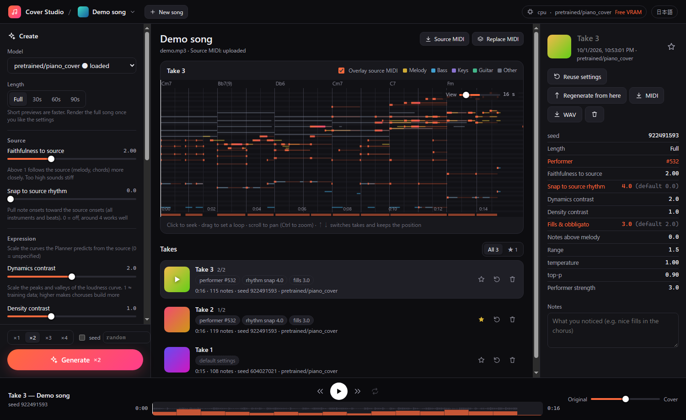
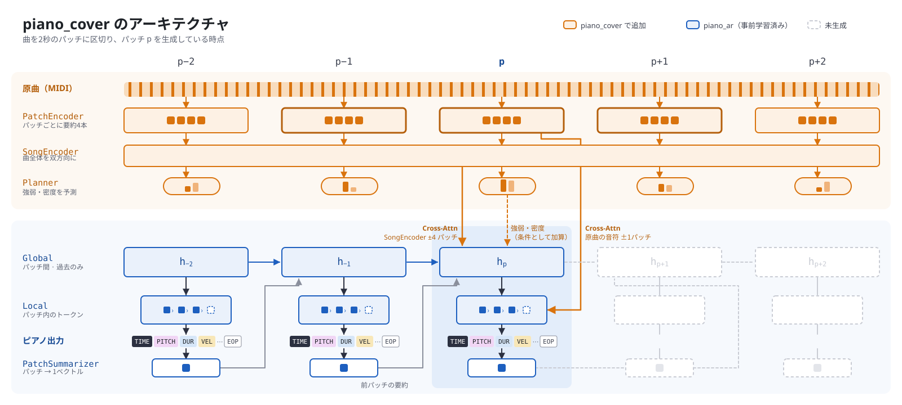
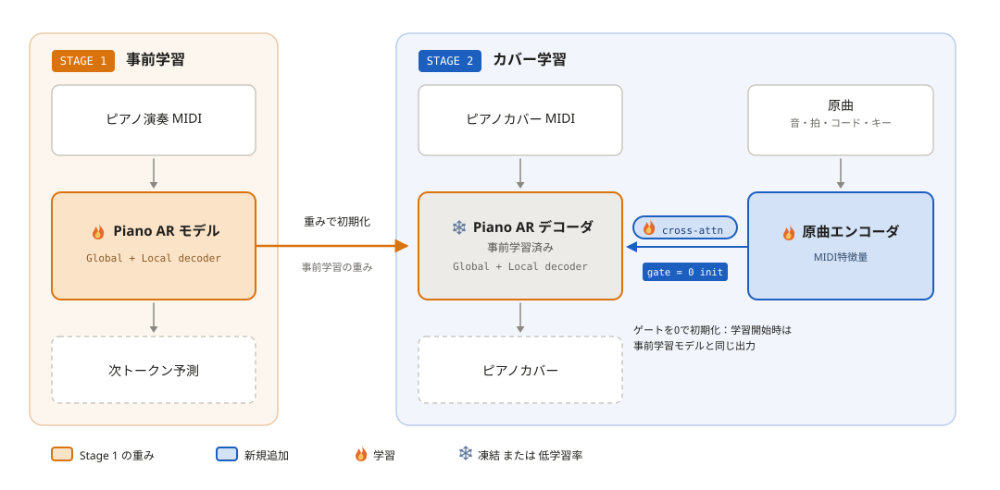

# tsumugi-piano-cover

**ポップスの音源から、ピアノカバーの MIDI を生成します。** 原曲はまず [tsumugi](https://github.com/anime-song/tsumugi) で多楽器の MIDI に採譜し、それを約 3,000 時間のピアノ演奏で事前学習したモデルに入れてカバーを生成します。

[English README](README.md) | [](LICENSE) | [](https://huggingface.co/anime-song/tsumugi-piano-cover) | [](https://colab.research.google.com/github/anime-song/tsumugi-piano-cover/blob/main/notebooks/cover_studio_colab_ja.ipynb)

- 🎹 **原曲と同じ時間軸のカバー**: 原曲の音源と重ねてそのまま再生できます
- 🎚️ **編曲を調整できる**: 原曲への忠実さ・強弱・合いの手・音域・演奏者の弾き方
- 🔁 **Cover Studio**: 設定を変えて何度でも作り直し、テイクを聴き比べ、好きな位置から作り直せる Web UI

---

## クイックスタート

### Google Colab

いちばん手軽なのは Colab のノートブック（[日本語](https://colab.research.google.com/github/anime-song/tsumugi-piano-cover/blob/main/notebooks/cover_studio_colab_ja.ipynb) / [English](https://colab.research.google.com/github/anime-song/tsumugi-piano-cover/blob/main/notebooks/cover_studio_colab_en.ipynb)）です。GPU のランタイムを選んで最初のセルを実行し、「▶ Cover Studio を開く」をクリックします。あとはブラウザの中で、曲のアップロード・採譜・生成・聴き比べ・ダウンロードまでできます。

### ローカル

Python 3.12 と NVIDIA GPU が必要です（CPU でも動きますが遅くなります）。requirements で PyTorch 2.13（CUDA 13.0）が入ります。

```bash
git clone https://github.com/anime-song/tsumugi-piano-cover.git
cd tsumugi-piano-cover
python -m venv .venv
.venv/bin/pip install -r requirements.txt     # Windows: .venv\Scripts\pip
.venv/bin/python -m cover_studio              # http://127.0.0.1:8100 が開きます
```

モデルの重みは、初めてカバーを生成するときに Hugging Face から自動でダウンロードされます。画面もビルド済みのものを GitHub の Release から取ってくるので、Node.js は要りません。

Cover Studio の中で音源から採譜するには、tsumugi を別の環境として `.tsumugi/tsumugi` に用意します。

```bash
git clone https://github.com/anime-song/tsumugi.git .tsumugi/tsumugi
cd .tsumugi/tsumugi
uv sync --locked --extra stem
```

Cover Studio はこれを自動で見つけ、tsumugi の環境の Python で採譜を実行します（別の場所に置くときは `--tsumugi-dir`）。Windows では torchcodec のために FFmpeg の共有ライブラリ版も要ります。`.tsumugi/ffmpeg-shared/bin` に置くか、`--ffmpeg-dir` で指定してください。tsumugi がなくても、採譜済みの MIDI を音源と一緒に入れれば生成できます。

---

## Cover Studio



採譜は 1 曲につき一度だけです。生成は読み込んだモデルを使い回すので、設定を変えながら何度でも作り直せます。

- **テイク**: テイクごとに設定・seed・モデルを残します。「設定を使う」で左の「作る」欄に戻せます。一覧には既定値から変えた設定だけをチップで出します
- **ここから作り直す**: 再生位置より前はそのまま残し、続きだけを新しい設定で作り直します
- **聴き比べ**: 原曲の音源とカバーを同じ時計で再生します。テイクを切り替えても（↑ / ↓）再生位置はそのままです。原曲の MIDI を重ねたピアノロール、ループ区間、原曲とカバーの音量の配分も使えます
- **採譜の途中経過**: tsumugi が採譜したノートを、ステムごとに順にピアノロールに表示します
- **書き出し**: MIDI と、ブラウザの中でピアノの音源を使って作る WAV
- お気に入り・メモ・よく使う演奏者のテンプレート・日本語 / 英語の切り替え

```bash
python -m cover_studio --root D:/covers --port 8080 --no-browser
python -m cover_studio --device cpu
```

---

## Python API と CLI

```python
from piano_cover.generate import CoverParams, generate_covers, prepare_source
from piano_cover.model import CoverModel

model = CoverModel.from_pretrained(device="cuda")  # anime-song/tsumugi-piano-cover
source = prepare_source("song.mid", model.tokenizer, model.config)  # tsumugi で採譜した原曲の MIDI
cover = generate_covers(model, source, CoverParams(seconds=60, fill=2.5))[0]
model.tokenizer.events_to_midi(cover.events, "cover.mid")
```

```bash
python -m piano_cover.generate --checkpoint anime-song/tsumugi-piano-cover --source song.mid --seconds 60
python -m piano_ar.generate --checkpoint anime-song/tsumugi-piano-cover --seconds 60   # 原曲なしのピアノ曲
```

原曲の MIDI は、学習と同じ設定（ステム分離・楽器の再判定・ベロシティ・ビート / コード / キーの推定をすべて有効）の tsumugi で作ったものを使ってください。[`cover_studio/tsumugi_worker.py`](cover_studio/tsumugi_worker.py) がこの設定で採譜します。

### 生成の設定

| 設定 | 既定値 | 効果 |
| --- | --- | --- |
| `source_cfg` | 2.0 | 原曲への guidance。大きいほどメロディとコードに忠実になる |
| `onset_bias` | 0.0 | 出力の発音を原曲の発音に寄せる（4 前後がよい） |
| `dynamics` / `density` | 2.0 / 1.0 | 原曲から予測した強弱・音数の曲線の倍率 |
| `fill` / `above` / `span` | 2.0 / 0.0 / 1.5 | 合いの手・メロディの上に重ねる音・音域を、標準偏差の単位でずらす |
| `channel` / `channel_cfg` | 0 / 3.0 | 演奏者の番号（0 で指定なし）と、その弾き方に寄せる強さ |
| `temperature` / `top_p` | 1.0 / 0.90 | サンプリング |
| `seconds` | 全曲 | 冒頭だけ生成する（試し聴き用） |

---

## 仕組み



- 曲を **2 秒のパッチ** に分けて生成します。パッチの列を進める Global の Transformer と、パッチの中の音（時刻・音高・長さ・ベロシティ・ペダル）を 1 つずつ生成する Local の Transformer の 2 段で、時間の細かさは 10 ms です。
- 原曲は **tsumugi の多楽器の MIDI**（ドラムを含む全楽器の音と、拍・コード・キー）として入れます。パッチごとに要約し、曲全体をエンコードします。
- デコーダは **ゲート付きの cross-attention**（ゲートは 0 で始まる）で原曲を見ます。Global は今の時刻の付近の曲全体のエンコード、Local は原曲の音を 1 音ずつ見ます。
- **Planner** が原曲から強弱・音数・編曲の性質の曲線を予測し、生成の条件にします。強弱や編曲の設定は、この曲線を調整します。
- 学習では、カバーを原曲の時間軸に **伸縮しません**。カバーと原曲の対応は cross-attention で見る位置を決めるのにだけ使うので、対応の誤差でリズムが崩れません。



1. **事前学習（`piano_ar`）**: 約 3,000 時間のピアノの MIDI。採譜したピアノ演奏、PiJAMA、Pop2Piano のピアノ側、PIAST、MAESTRO を含みます。
2. **カバーの微調整（`piano_cover`）**: 約 780 曲・約 3,000 本（約 190 時間）のピアノカバーと、tsumugi で採譜した原曲の組。

学習データは配布していません。

---

## リポジトリの構成

| パス | 中身 |
| --- | --- |
| [`piano_ar/`](piano_ar) | ピアノ演奏のモデル（トークナイザー・モデル・事前学習） |
| [`piano_cover/`](piano_cover) | カバーモデル（原曲エンコーダ・Planner・データの準備・学習・生成） |
| [`cover_studio/`](cover_studio) | Cover Studio のサーバ（FastAPI）と tsumugi の worker |
| [`web/`](web) | Cover Studio の画面（React + Vite）。`npm run dev` / `npm run build` |
| [`notebooks/`](notebooks) | Colab のノートブック |
| [`piano_score/`](piano_score) | 演奏から楽譜を作るモデル（開発中） |

自分で学習したチェックポイントを公開と同じ形式にするには `python -m piano_cover.export --checkpoint <best.pt> --out <フォルダ>` を使います（ピアノのモデルは `piano_ar.export`）。

---

## 苦手なこと

- tsumugi の採譜の誤り（メロディ・拍・コード）はカバーにそのまま出ます。リズムは原曲の MIDI の拍に強く依存します
- スウィングがイーブンになりがちです
- 人の演奏よりサステインペダルを長く踏みがちです
- 出力は演奏の MIDI で、楽譜ではありません

## ライセンス

- コード: [MIT License](LICENSE)
- モデルの重み（[Hugging Face](https://huggingface.co/anime-song/tsumugi-piano-cover)）: [CC BY-NC 4.0](https://creativecommons.org/licenses/by-nc/4.0/deed.ja)（非商用）

## 謝辞

- [tsumugi](https://github.com/anime-song/tsumugi) — 原曲の多楽器の採譜
- [smplr](https://github.com/danigb/smplr) — Cover Studio の再生に使うピアノの音源
- Cover Studio の構成は [audio2chordpro](https://github.com/anime-song/audio2chordpro) を参考にしています
